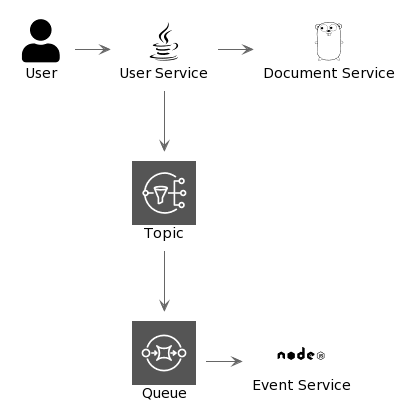

# Distributed System Sample

## Architecture

## TODOS

### User Service

- [x] Start user service with Java using Spring Boot
- [x] Develop POST user API
- [x] Config Wiremock to simulate document endpoint
- [] Config LocalStack to simulate AWS SNS
- [] Send event to SNS
- [x] Github Actions
- [x] SonarQube

### Document Service

- [x] Start document service with Golang
- [x] Develop GET Document API
- [x] Github Actions
- [x] SonarQube

### Event Service

- [] Start event service with NodeJS
- [] Config LocalStack to simulate AWS SQS
- [] Consuming event from SQS
- [] Github Actions
- [] SonarQube
